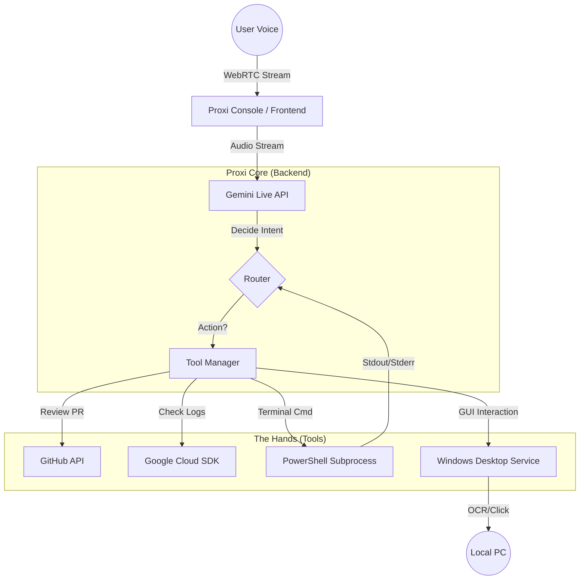

# Proxi: The Headless Operator

**Mission:** To build an agentic, voice-first interface that allows developers to perform "Headless SDLC" tasks (Triage, Ops, Architecture) without looking at a screen. It acts as a remote control for Google Cloud, GitHub, and your local desktop.

## 📦 System Modules

Proxi consists of three distinct modules that can be deployed together or independently depending on the use case.

### 1. Proxi Core (Backend)
The brain of the operation. Built with Python (FastAPI), it handles:
*   **Gemini 3 Pro Integration**: For high-level reasoning and complex tool planning.
*   **Gemini Live API**: For real-time, low-latency, interruptible voice interaction.
*   **Standard Tools**: Integration with GitHub API (PRs/Issues) and Google Cloud SDK (Logs/Restarts).

### 2. Proxi Console (Frontend)
A React-based visual control plane for the human operator.
*   **Visualizer**: Real-time audio waveform visualization (WebRTC/PCM).
*   **Terminal**: Streaming logs of agent thoughts, tool execution, and raw JSON outputs.
*   **Controls**: Toggles for "Deep Thought" mode (reasoning models) vs "Reflex" mode (fast models).

### 3. Proxi Ghost (Windows Agent)
*Experimental Feature.*
A specialized mode where the backend runs locally on a Windows machine to act as a "Ghost Operator".
*   **Shell-First Architecture**: Prioritizes `PowerShell` commands for reliability (works even if screen is locked).
*   **OS Accessibility**: Uses Windows UIAutomation to read window state instantly.
*   **Computer Vision**: Fallback to `EasyOCR` if the OS API fails.
*   **Use Case**: "Proxi, restart the Nginx service," or "Click the 'Deploy' button in the legacy app."

---

## 🛠️ Deployment Guide

### Scenario A: Production / Cloud Deployment (Standard)
*Best for: Hosting the full stack (Core + Console) on a Linux server or Google Cloud Run for standard DevOps tasks.*

This sets up the entire stack using Docker containers behind an Nginx reverse proxy.

**Prerequisites:** Docker, Docker Compose, Git.

1.  **Setup Environment:**
    Create a `.env` file in the root:
    ```ini
    GEMINI_API_KEY=your_key_here
    GITHUB_TOKEN=your_token_here
    ```

2.  **Run Deployment Script:**
    ```bash
    ./deploy.sh
    ```
    This script will:
    *   Pull the latest code.
    *   Build Docker images for Frontend and Backend.
    *   Start services via `docker-compose`.
    *   Configure Nginx for reverse proxying (Port 80 -> Frontend, /api -> Backend).

3.  **Access:**
    *   Frontend: `http://localhost` (or your domain)
    *   Backend API: `http://localhost/api`

---

### Scenario B: Ghost Operator Setup (Windows Local)
*Best for: Running Proxi on a specific Windows machine to control its desktop.*

This installs the backend directly on Windows (bare metal) with desktop automation libraries enabled.

**Prerequisites:**
*   Windows 10/11 or Windows Server 2019+.
*   **PowerShell** (Run as Administrator).
*   **Python 3.10+** installed and added to system PATH.

1.  **Run Windows Setup:**
    Open PowerShell as Administrator in the project root:
    ```powershell
    .\setup_windows.ps1
    ```
    This script performs the following:
    *   Creates a secure Python Virtual Environment (`venv`) to isolate dependencies.
    *   Installs desktop-specific libraries (`pyautogui`, `easyocr`, `opencv`).
    *   **Safety Check**: Briefly moves the mouse to verify GUI session access.
    *   Generates a startup script `run_proxi.bat`.

2.  **Configuration:**
    *   The script creates a `.env` file if one doesn't exist. **Edit this file** to add your `GEMINI_API_KEY`.

3.  **Start the Agent:**
    Double-click `run_proxi.bat` or run via command line:
    ```cmd
    run_proxi.bat
    ```
    The backend will listen on `0.0.0.0:8080`.

4.  **Unattended Access (Road Warrior Mode):**
    If you are accessing via RDP and need to disconnect while keeping Proxi active:
    *   **DO NOT** close the RDP window normally (this locks the screen and kills GUI automation).
    *   **DO** run the included `disconnect_keep_alive.bat` script.
    *   This forces the RDP session to detach but remain **unlocked and rendering** on the server console, allowing Proxi's Vision/Click tools to keep working.

    *> **Note**: The Windows setup only runs the Backend. To use the Console UI, you must run the frontend separately (e.g., `npm run dev` in the frontend folder) or make API calls directly.*

---

## 🎮 Usage

### Voice Commands (Gemini Live)
Click **"INITIATE UPLINK"** on the console.
*   *"Check the logs for the auth-service."* (Uses Shell/PowerShell)
*   *"Is there an open PR for the JWT feature?"* (Uses GitHub API)
*   *(Ghost Mode)* *"Click the start button and type 'Notepad'."* (Uses Hybrid Vision/Accessibility)

### Text / Vision Mode
Use the terminal input at the bottom.
*   **Text**: "Analyze the system architecture."
*   **Vision**: Click the Camera icon to upload a diagram or screenshot for technical analysis.

## 🏗️ Architecture

