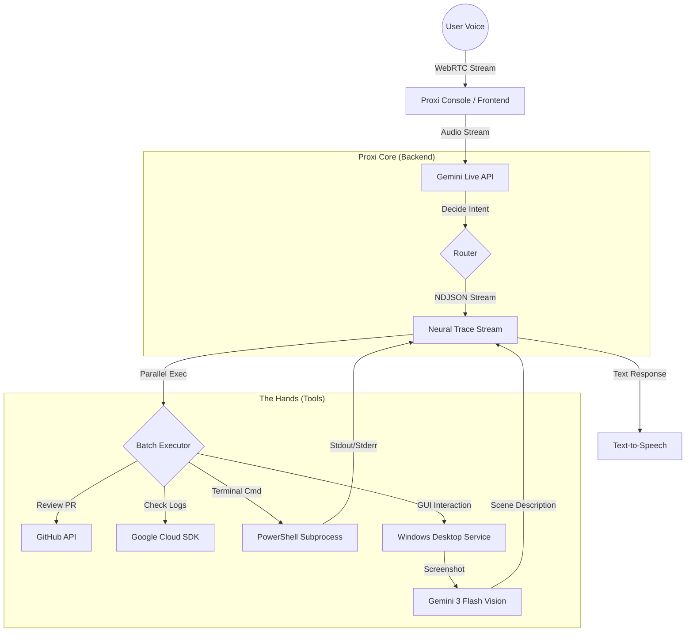

# Proxi: The Headless Operator

**Mission:** To build an agentic, voice-first interface that allows developers to perform "Headless SDLC" tasks (Triage, Ops, Architecture) without looking at a screen. It acts as a remote control for Google Cloud, GitHub, and your local desktop.

## ⚡ Key Features

*   **Voice-First Control:** Full duplex voice interaction using **Gemini Live API** (WebRTC) and Text-to-Speech.
*   **Neural Trace:** Visualize the agent's internal thought process, tool planning, and execution steps in real-time.
*   **Parallel Execution:** The agent intelligently batches tool calls (e.g., checking multiple logs simultaneously) for maximum speed.
*   **Ghost Mode:** Run the backend locally on Windows to control your mouse, keyboard, and read the screen using accessibility trees and **Gemini Vision**.
*   **Streaming Brain:** The backend streams thoughts and actions via NDJSON, providing immediate feedback during complex tasks.

## 📦 System Modules

Proxi consists of three distinct modules that can be deployed together or independently.

### 1. Proxi Core (Backend)
The brain of the operation. Built with Python (FastAPI), it handles:
*   **Gemini 3 Pro Integration**: For high-level reasoning and complex tool planning.
*   **Streaming Architecture**: Uses Async Generators to stream "Thoughts" and "Tool Outputs" to the UI line-by-line.
*   **Parallel Tooling**: Automatically detects independent tasks and runs them concurrently using `asyncio.gather`.
*   **Standard Tools**: Integration with GitHub API (PRs/Issues) and Google Cloud SDK.

### 2. Proxi Console (Frontend)
A React-based visual control plane for the human operator.
*   **Visualizer**: Real-time audio waveform visualization (WebRTC/PCM).
*   **Neural Trace View**: A graphical timeline showing the decision tree (User Input -> LLM Thought -> Tool Call -> Result -> Speech).
*   **Terminal**: Raw streaming logs of agent activity.
*   **Controls**: Toggles for "Deep Thought" mode (reasoning models) vs "Reflex" mode (fast models).

### 3. Proxi Ghost (Windows Agent)
*Experimental Feature.*
A specialized mode where the backend runs locally on a Windows machine to act as a "Ghost Operator".
*   **Shell-First Architecture**: Prioritizes `PowerShell` commands for reliability.
*   **Hybrid Vision**: Uses Windows UIAutomation for fast UI reading, falling back to **Gemini 3 Flash Vision** for complex visual analysis (screenshots).
*   **Use Case**: "Proxi, restart the Nginx service," or "Click the 'Deploy' button in the legacy app."

---

## 🛠️ Deployment Guide

### Scenario A: Production / Cloud Deployment (Standard)
*Best for: Hosting the full stack (Core + Console) on a Linux server or Google Cloud Run.*

1.  **Setup Environment:**
    Create a `.env` file in the root:
    ```ini
    GEMINI_API_KEY=your_key_here
    GITHUB_TOKEN=your_token_here
    ```

2.  **Run Deployment Script:**
    ```bash
    ./deploy.sh
    ```
    This pulls the latest code, builds Docker images, and configures Nginx.

3.  **Access:**
    *   Frontend: `http://localhost`
    *   Backend API: `http://localhost/api`

---

### Scenario B: Ghost Operator Setup (Windows Local)
*Best for: Controlling a specific Windows machine's desktop.*

**Prerequisites:** Windows 10/11, PowerShell (Admin), Python 3.10+.

1.  **Run Windows Setup:**
    Open PowerShell as Administrator in the project root:
    ```powershell
    .\setup_windows.ps1
    ```
    This creates a Python Virtual Environment (`venv`), installs desktop automation libs (`pyautogui`, `opencv`), and generates a startup script.

2.  **Configuration:**
    Edit the generated `.env` file to add your `GEMINI_API_KEY`.

3.  **Start the Agent:**
    Double-click `run_proxi.bat`. The backend will listen on `0.0.0.0:8080`.

4.  **Unattended Access:**
    Use `disconnect_keep_alive.bat` when exiting RDP to keep the session active and unlocked for the vision agent.

---

## 🎮 Usage

### Voice Commands (Gemini Live)
Click **"INITIATE UPLINK"** on the console.
*   *"Check the logs for the auth-service."* (Uses Shell/PowerShell)
*   *"Is there an open PR for the JWT feature?"* (Uses GitHub API)
*   *(Ghost Mode)* *"Click the start button and type 'Notepad'."* (Uses Hybrid Vision)

### Text / Vision Mode
Use the terminal input at the bottom.
*   **Text**: "Analyze the system architecture." (Streams thoughts and actions)
*   **Vision**: Click the Camera icon to upload a diagram or screenshot.

## 🏗️ Architecture

