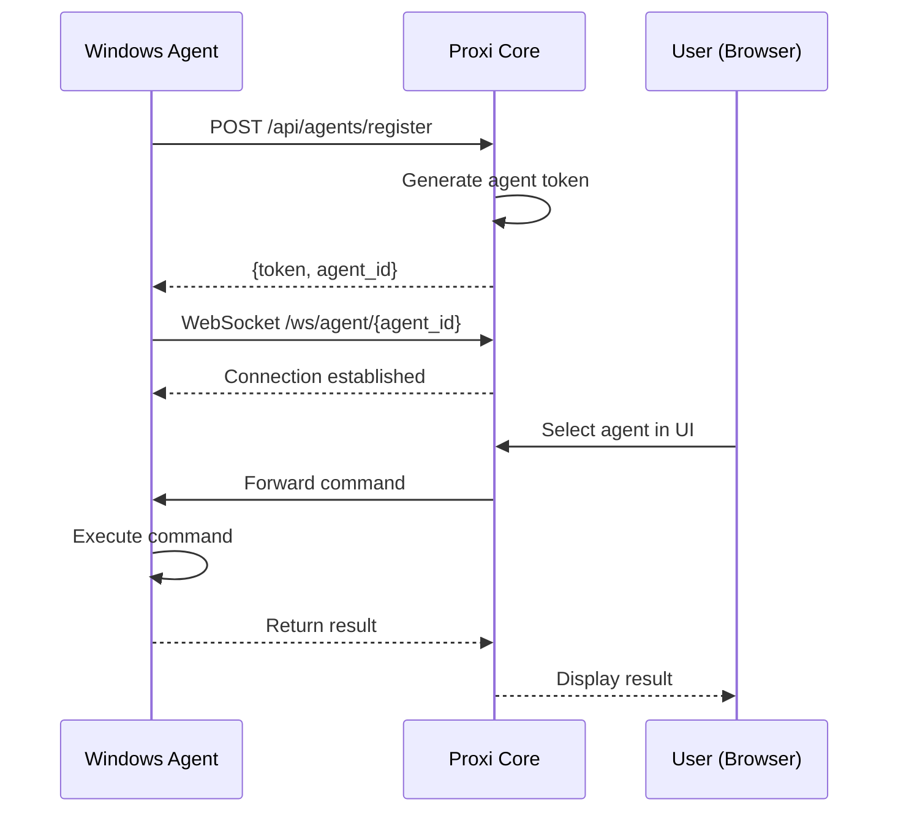

# Windows Agent Setup Guide

## Connecting a Windows Desktop to Proxi Core

This guide explains how to register a Windows machine as a remote agent that Proxi can control.

---

## Prerequisites

- Windows 10/11 with Python 3.10+
- Network access to Proxi Core server
- Admin rights (for some automation features)

---

## Quick Start

### 1. Clone the Repository

```powershell
git clone https://github.com/vermamanoj/proxi-ai.git
cd proxi-ai
```

### 2. Install Dependencies

```powershell
# Create virtual environment
python -m venv venv
.\venv\Scripts\Activate.ps1

# Install Windows-specific requirements
pip install -r backend/requirements.txt
```

### 3. Configure the Agent

Create a `.env` file in the project root:

```env
# Agent Configuration
AGENT_NAME=my-windows-pc
CORE_URL=http://your-core-server:4000

# Optional: For GUI automation
ENABLE_GUI_AUTOMATION=true
```

### 4. Start the Agent

```powershell
python -m backend.agent.run_agent
```

---

## Architecture

```
┌─────────────────────────────────────────────────────────────┐
│                    Proxi Core (Cloud/Server)                │
│  ┌─────────────┐  ┌─────────────┐  ┌─────────────────────┐  │
│  │  Auth API   │  │ Session DB  │  │  Gemini Live API    │  │
│  └─────────────┘  └─────────────┘  └─────────────────────┘  │
│                          │                                  │
│                    Agent Registry                           │
└──────────────────────────┬──────────────────────────────────┘
                           │ WebSocket
                           ▼
┌──────────────────────────────────────────────────────────────┐
│                   Windows Agent (Your PC)                    │
│  ┌──────────────┐  ┌──────────────┐  ┌───────────────────┐  │
│  │ Command Exec │  │ Screenshot   │  │ GUI Automation    │  │
│  │ (PowerShell) │  │ (PIL)        │  │ (pyautogui)       │  │
│  └──────────────┘  └──────────────┘  └───────────────────┘  │
└──────────────────────────────────────────────────────────────┘
```

---

## Agent Capabilities

| Capability | Description | Requires |
|------------|-------------|----------|
| **Terminal Commands** | Execute PowerShell/CMD | Base install |
| **Screenshots** | Capture desktop/windows | `pillow` |
| **GUI Automation** | Mouse/keyboard control | `pyautogui` |
| **Window Management** | List/focus windows | `pywinauto` |
| **Clipboard** | Read/write clipboard | `pyperclip` |

---

## Registration Flow



---

## Security Considerations

### Command Guard

The agent uses `CommandGuard` to filter dangerous commands:

```python
# Blocked commands (never executed)
- format, fdisk, diskpart
- Remove-Item -Recurse on system paths
- reg delete on critical keys
- Disabling security features

# Approval required
- Installing software (choco, winget, pip install)
- Modifying registry
- Creating scheduled tasks
- Network configuration changes
```

### Network Security

1. **Use HTTPS** - Always connect over TLS in production
2. **Firewall** - Agent only needs outbound to Core server
3. **Token rotation** - Rotate agent tokens periodically

---

## Troubleshooting

### Agent won't connect

```powershell
# Check network connectivity
Test-NetConnection -ComputerName your-core-server -Port 4000

# Check agent logs
Get-Content .\proxi_debug.log -Tail 50
```

### GUI automation not working

```powershell
# Ensure display scaling is 100%
# Or set DPI awareness in script
import ctypes
ctypes.windll.shcore.SetProcessDpiAwareness(2)
```

### Permission errors

Run PowerShell as Administrator for:
- Registry modifications
- Service management
- System file access

---

## Advanced Configuration

### Running as a Windows Service

```powershell
# Install NSSM (Non-Sucking Service Manager)
choco install nssm

# Create service
nssm install ProxiAgent "C:\path\to\python.exe" "-m backend.agent.run_agent"
nssm set ProxiAgent AppDirectory "C:\path\to\proxi-ai"
nssm start ProxiAgent
```

### Multiple Agents

Each Windows machine needs a unique `AGENT_NAME`:

```env
# PC 1
AGENT_NAME=dev-workstation

# PC 2  
AGENT_NAME=test-server

# PC 3
AGENT_NAME=build-machine
```

---

## API Reference

### Register Agent

```http
POST /api/agents/register
Content-Type: application/json

{
  "name": "my-windows-pc",
  "os": "windows",
  "capabilities": ["terminal", "screenshot", "gui"]
}
```

### Agent Heartbeat

```http
POST /api/agents/{agent_id}/heartbeat
Authorization: Bearer {agent_token}

{
  "status": "idle",
  "cpu": 15.2,
  "memory": 45.8
}
```

### Execute Command (via WebSocket)

```json
{
  "type": "execute",
  "command": "Get-Process | Select-Object -First 5",
  "shell": "powershell"
}
```

---

*Last updated: 2026-01-27*
